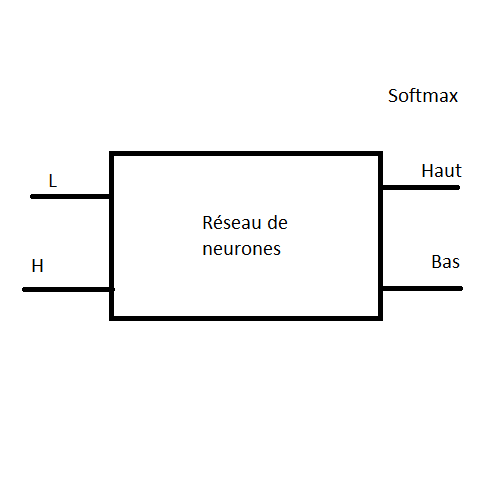
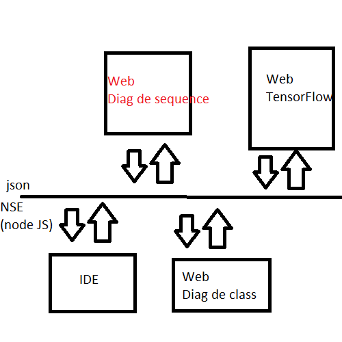

Démarche suivie dans la réalisation du projet
=============================================

Réaliser un réseau neuronal simple et l'etoffer au fur et à mesure. <br/>
Il aura d'abord pour but de classifier des rectangles selon leur taille pour savoir s'il doit les placer en haut ou en bas. D'autres paramètres seront ensuite pris en compte en entrée (couleurs, etc) et on pourra aussi prendre plus de paramètres de sortie. <br/>
Dans un premier temps, nous travaillons sur des rectangles que nous générons nous-même, mais par la suite le but sera de récupérer ces données concernant de "vraies classes" via des fichiers JSON. (Pour la taille d'une classe, on se basera sur le nombre de lignes à l'intérieur et sur la longueur de la plus grande ligne). <br/>
Des jeux de tests seront générés (jeux d'apprentissage et jeux de tests) pour pouvoir tester différents réseaux neuronnaux et vérifier quelles configurations donnent les meilleurs résultats (nombre de couches, nombre de neurones, fonctions d'activation, etc).



Fonctions d'activation à tester :
 - Relu
 - pRelu
 - leakyRelu
 - elu
 - softmax ou sigmoid pour la couche de sortie




Configuration du réseau neuronal
================================

Dans cette partie nous expliquons comment fonctionne la création du réseau neuronal et ce à quoi correspondent les paramètres choisis pour sa configuration.
- __Initialisation__ <br/>
L'initialisation du modèle se fait de cette manière : `let model = tf.sequential();`<br/>
Le mode "*sequential*" est le plus facile à manipuler. Cela fonctionne comme une suite linéaire de couches dont les sorties de l'une sont reliées aux entrées de la suivante. Une autre possibilité est d'utiliser `tf.model(layers)` qui offre plus de contrôle et permets de faire des branchements plus personnalisés entre les couches.

- __Création des couches cachées__ <br/>
```js
let layer = tf.layers.dense({
    inputShape: [2], //nombre de paramètres d'entrée, seulement requis pour la 1ère couche cachée
    units: nbNeurons, //nombre de neurones de cette couche
    activation: activationFunction //fonction d'activation utilisée
});
model.add(firstHiddenLayer); //ajoute la couche au modèle
```
Rq : *dense()* signifie que c'est une couche entièrement connectée.

- __Compilation du modèle__ <br/>
Cette étape sert à préparer le modèle pour l'entraînement et l'évaluation.
```js
model.compile({
    optimizer: 'sgd',
    loss: 'meanSquaredError',
    lr: learningRate
});
```
*optimizer* : Méthode de minimisation d'erreur utilisée. Ici, nous utilisons *sgd* pour la *descente de gradient stochastique*. <br/>
*loss* : fonction utilisée pour le calcul de l'erreur. Ici nous utilisons *meanSquaredError*. <br/>
*lr* : Learning rate. Représente un coefficient lors de la minimisation pour déterminer quel sera le point suivant. Avec un learning rate petit, l'algorithme sera plus lent (car on fait des plus petits pas) mais sera plus précis pour trouver le minimum de la fonction d'erreur. Avec un learning rate grand, le calcul sera plus rapide mais potentiellement moins précis car avec des pas trop grands on risque de rater le minimum.


Ce qui a été réalisé
====================

(dans branche Master) <br/>

Onglet _Neural_ : <br/>
Une interface permet de paramétrer le réseau neuronal (nb de couches, nb de neurones, fonctions d'activation, learning rate)

Onglet _Learning_ : <br/>
Interaction avec des boutons permettant de décider le nombre de rectangles qui vont servir pour l'apprentissage et décider des données d'entrée pour la prédiction.
- *Add one learn square*. Ajoute un seul rectangle à l'apprentissage du modèle
- *Learn from a file*. Permet de charger des données à partir d'un fichier et de faire l'apprentissage (pas encore fonctionnel)
- *Ajout auto*. Ajoute un rectangle à l'apprentissage du modèle par seconde.
- *Save*. Permet d'enregistrer les données générées dans un fichier json (ne marche pas sur Firefox, mais fonctionne sur Chrome)

Onglet _Predict_ : <br/>
- *Predict*. Essaye de prédire la position d'un rectangle et l'affiche à droite. (hauteur et largueur doivent être < 400 !)
- *Predict the test*. Envoie les données d'apprentissage sur la prédiction et affiche le pourcentage de réussite.
- *Predict from a file*. Permet d'afficher les prédictions à partir de données stockées dans un fichier json

Onglet _Save and Load Model_ : (__REMARQUE :__ Ne fonctionne qu'avec Google Chrome et Chromium)
- *Save Model*. Télécharge la configuration du modèle et les poids dans deux fichiers `my-model-1.json` et `my-model-1.weights.bin`
- *Upload Json Model* et *Upload weights*. Charge le fichier json et le .bin contenant le modèle et les poids (de la même forme que ceux téléchargeables via *Save Model*)
- *Load Model*. Charge le modèle après que l'on ait préalablement chargé les fichiers requis via les deux boutons précédents.

Serveur
=======

Se mettre dans le dossier et exécuter la commande `php -S localhost:8000` pour lancer un serveur qui renverra vers ce lien : [localhost:8000/testGenerate.html](http://localhost:8000/testGenerate.html)

Faire :
~~~~
cd web
php -S localhost:8000
~~~~


Liens utiles
============

 [Enregistrer JSON](https://stackoverflow.com/questions/34156282/how-do-i-save-json-to-local-text-file)

 Pour sauvegarder le modèle : <br/>
 https://js.tensorflow.org/tutorials/model-save-load.html

NB
==
Nous utilisons P5 et MDL pour l'affichage de la page et le dessin dans le canvas.
